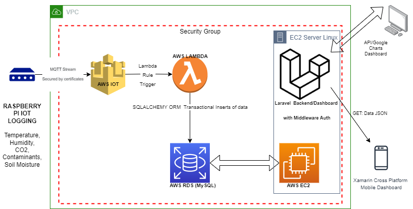

# AWS_Lambda_IOT2SQL
 AWS Lambda Handlers triggered on AWS IoT MQTT Event. IoT Rule > Lambda Parses Event JSON to SQLalchemy ORM Objects to be inserted into AWS RDS (MySQL))

 

 TODO: Add .env.example and Mini Guide
